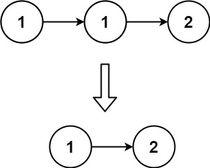
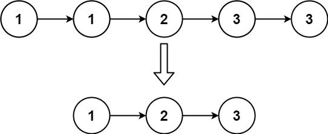

# LeetCode problem 148
Removing duplicatees from a singly linked list

## Given
A singly linked list was given and we had to remove any duplicate element from it.


Definition for singly-linked list.

```cpp
  struct ListNode {
     int val;
     ListNode *next;
      ListNode() : val(0), next(nullptr) {}
      ListNode(int x) : val(x), next(nullptr) {}
      ListNode(int x, ListNode *next) : val(x), next(next) {}
  };
```

# Approach

### ListNode* deleteDuplicates(ListNode* head): 

This function takes the head of a linked list as input and returns the head of the modified linked list with duplicates removed.

1. Base case: If the head is NULL or there's only one element in the list, it returns the head.

2. It initializes two pointers: curr (set to the head of the list) and prev (set to NULL). curr is used to iterate through the list, while prev keeps track of the previous node.

3. An unordered set seen is created to store the unique values encountered in the list.

4. The while loop iterates through the list until curr becomes NULL.

5. If the value of the current node (curr->val) is found in the seen set, it means this value is a duplicate. In this case, the previous node (prev) is connected to the next node of the current node (curr->next), effectively removing the current node from the list. Then, the current node is deleted using delete(curr).

6. If the value of the current node is not found in the seen set, it is inserted into the set, and prev is updated to point to the current node.

7. After each iteration, curr is updated to point to the next node in the list (prev->next).

8. Finally, the function returns the head of the modified linked list with duplicates removed.


Example: <br/><br/>


